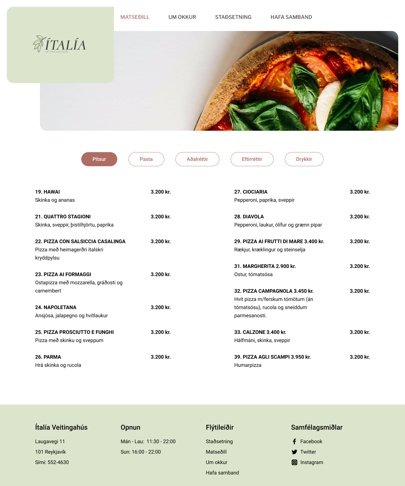
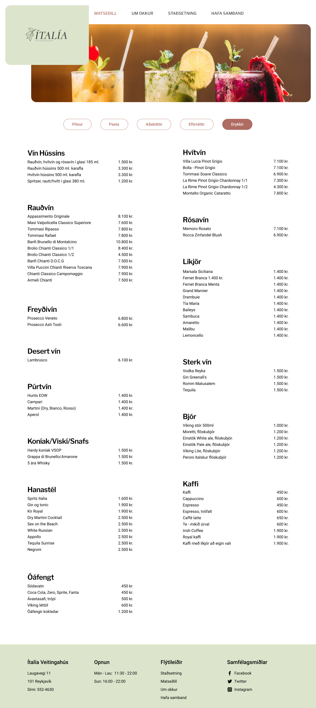
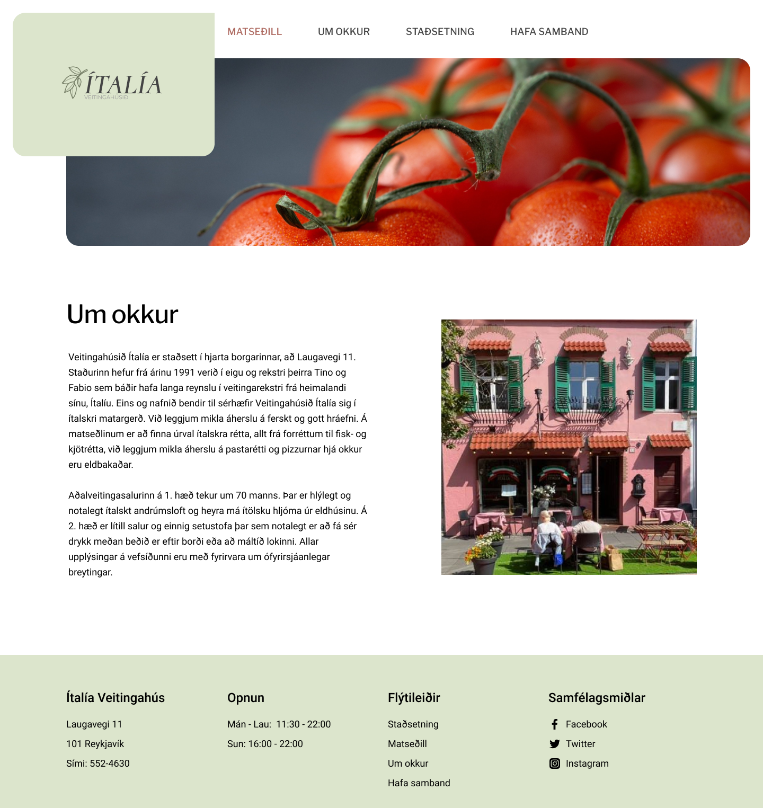
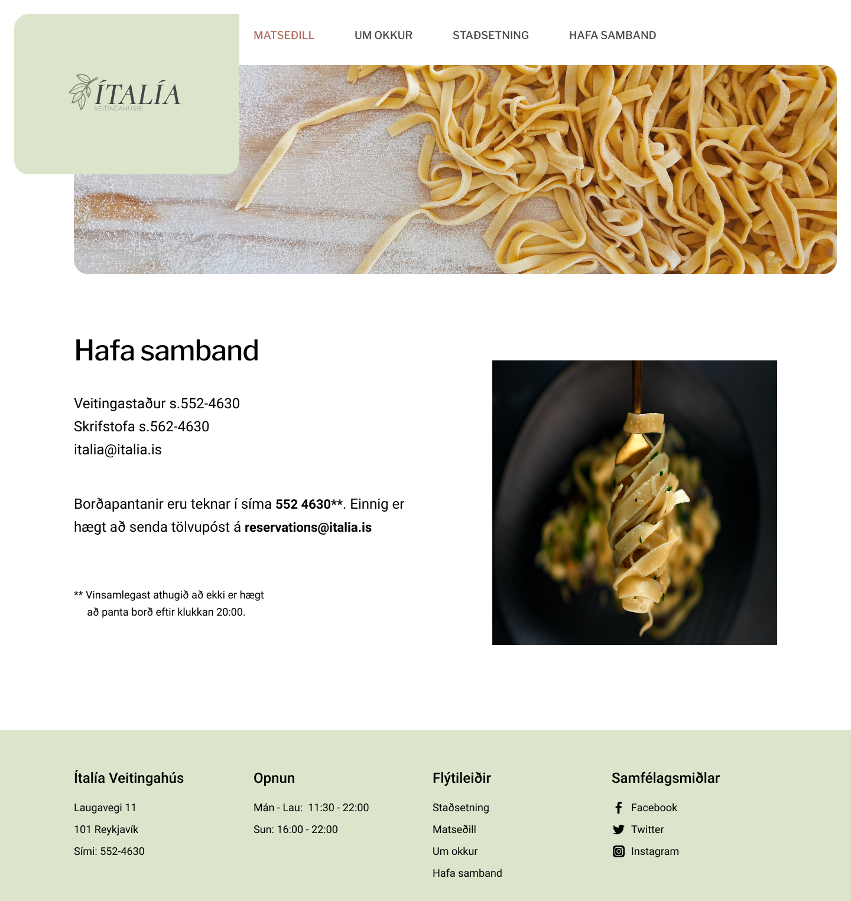

# Design - UI Redesign

Here is my [Figma project](https://www.figma.com/file/oRdqk4SR7N2ZZZWrV1idG8/UI-Redesign?node-id=0%3A1)  
 
In this project i redesigned a website for Ítalía restaurant. I also did some rebranding, made a new logo to freshen up the whole look of the company.  
 
I wanted to keep some of the classical elements of the logo so I decided to stick with a serif, italic for the main font in the logo, so I chose Cormorant font in semi bold and italic. I then chose a sans serif font for the sub font to make it a bit more current.  
For the website content I chose a sans serif font for headings and body to keep it clean and up to date.  
 
For the colors I wanted to stray away from the deep green and red and opt for a warmer more welcoming olive green and copper red.
 

## Redesign principles used in project

I used a 14 column grid to position and align elements in the design.
I used

