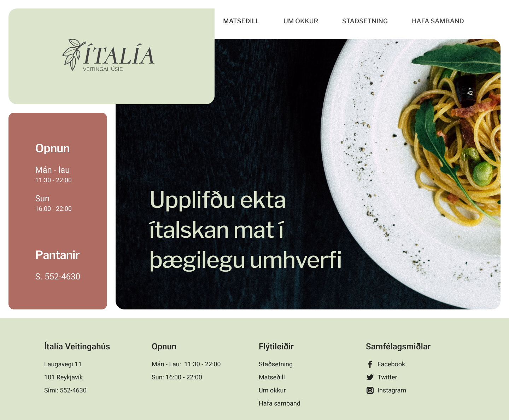

# Design - UI Redesign

Here is my [Figma project](https://www.figma.com/file/oRdqk4SR7N2ZZZWrV1idG8/UI-Redesign?node-id=0%3A1)  
 
In this project i redesigned a website for Ítalía restaurant. I also did some rebranding, made a new logo to freshen up the whole look of the company.  
 
. 
 
 

## UI design priciples used in this project

### Use of whitespace
I used whitespace around grouped elements and between sections to give some breathing space, which also makes use of the proximity principle. 
 
### Use of alignment
I used a 14 column grid to position and align elements in the design, with a 24px gutter and margins on each side.
 
### Use of contrast
I made sure to use dark colored text on light background and light on dark background for contrast so eveything will be easy to read. Because my background is completely white I used dark gray colors for fonts so the contrast would be a little softer - so my "black" for body text is #222 and "charcoal" for headings is #444.
For good contrast in font sizing I used the 8pt grid, 64px for h1, 48px for h2, 32px for h3, 24px for large body text and 18px for main body text.
 
### Practical use of Color
For the colors I wanted to stray away from the deep green and red and opt for a warmer more welcoming olive green and copper red, which are complimentary in the color wheel. I used the olive green as the main color and the copper red as the accent color, for hover state/active links and for the menu tabs. Dark gray colors are used for main text and headings.
 
### Use of overall Scale
As the content was not very dense I made use of images as a kind of focal point and also as the logo is very minimalistic I added a spacious background to make it stand out more. On the front page I made sure the opening hours and phone number were most noticeable so I used the accent color as a background for that information.
The font sizes used is also a use of visual hierarchy.

### Typography
I wanted to keep some of the classical elements of the logo so I decided to stick with a serif, italic for the main font in the logo, so I chose Cormorant font in semi bold and italic. I then chose a sans serif font for the sub font to make it a bit more current and minimal.  
For the website content I chose a sans serif font for headings and body to keep it clean, minimal and up to date.
